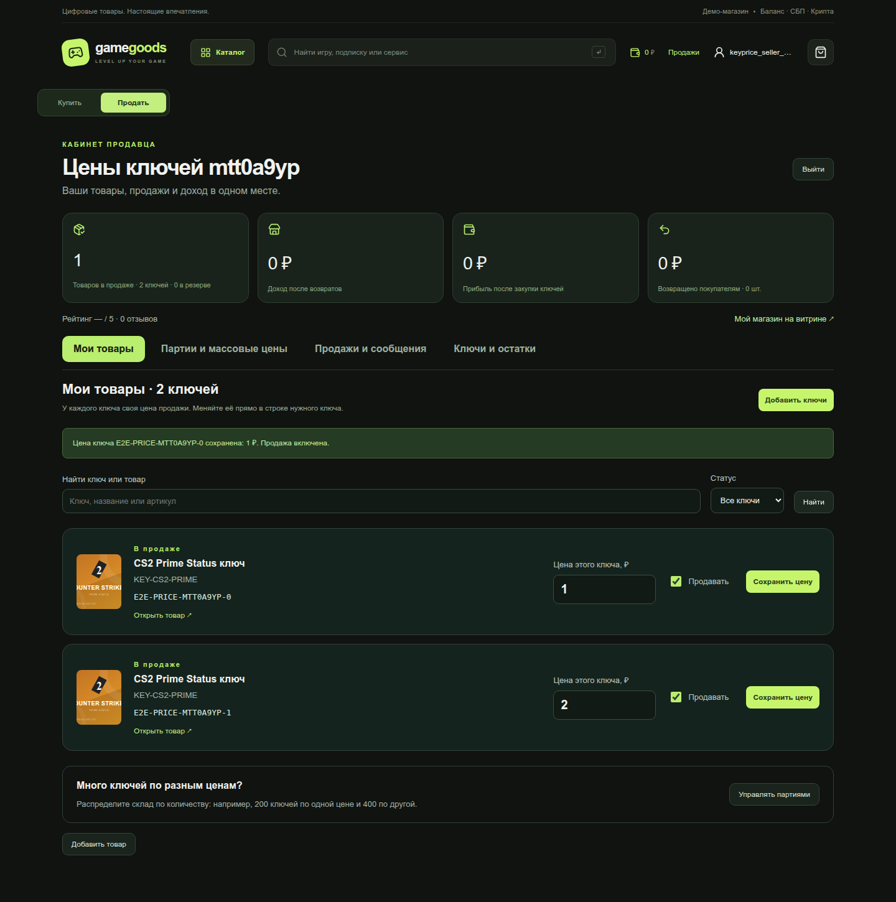

# Store Frontend — витрина и кабинеты

[](https://github.com/ps5tur5-sketch/Store-Frontend/actions/workflows/verify.yml)
Дополнительный интерфейс к [Store-Backend](https://github.com/ps5tur5-sketch/Store-Backend), где выполнено основное [ТЗ и приведены ответы](https://github.com/ps5tur5-sketch/Store-Backend/blob/main/docs/SUBMISSION.md). [Изменения](CHANGELOG.md) · [Браузерные проверки](docs/VERIFICATION.md).

Vue 3 + TypeScript + Vite. Прежняя структура `src/components`, `App.vue`, `auth.ts`, `api.ts`, `types.ts` сохранена. Сборка обслуживается nginx, отдельный Docker Compose не зависит от каталога backend.

```bash
git clone https://github.com/ps5tur5-sketch/Store-Frontend.git
cd Store-Frontend
cp .env.example .env
docker compose up -d --build
```

Backend запускается отдельно по его инструкции. Для обновления существующей установки: `git pull --ff-only` и `docker compose up -d --build`, сохранив свой `.env`.

Адрес по умолчанию: http://127.0.0.1:8080. `API_BASE_URL` в `.env` задаёт доступный браузеру адрес backend, например `http://127.0.0.1:3000`. Entrypoint записывает `/config.js`; изменение адреса не требует переписывать исходники. Для разработки: `npm ci`, `npm run dev`; проверка типов и production-сборка: `npm run build`.

## Страницы

| Маршрут | Назначение |
| --- | --- |
| `/` | Адаптивная витрина, серверный поиск, фильтры и сортировка |
| `/product/:sku` | Описание, выбор продавца по цене, рейтингу, остаткам и флагу |
| `/seller/:provider` | Публичный профиль, подтверждённые нарушения и отзывы |
| `/cart` | Корзина по предложениям/партиям продавцов, серверный расчёт и один checkout |
| `/account` | Явный выбор регистрации покупателя/продавца, вход, кабинет, баланс и платежи |
| `/purchase/:id` | Покупка, ключ, отзыв 1–5 и переписка |
| `/seller/account` | Собственные предложения, цены, ключи, продажи и чаты продавца |
| `/admin` | Заказы, платежи, баны, возвраты, пользователи, продавцы, склад, очередь и денежные отчёты |

Реквизиты демонстрационных аккаунтов приведены в [README backend](https://github.com/ps5tur5-sketch/Store-Backend#демо-аккаунты). Роль пользователя приходит из backend; скрытие элементов интерфейса дополняет серверную проверку прав.

## Данные и оформление

Корзина, деньги, статусы, отзывы, рейтинг, доказательства и переписка находятся в PostgreSQL через backend API. В localStorage хранится токен сессии, в sessionStorage — тело ещё не подтверждённого checkout для повторения с тем же ID после сетевой ошибки. Браузер не создаёт собственные балансы, цены, рейтинги или результаты возврата.

`OrderProgress` показывает уже рассчитанные сервером суммы и прогресс. `ReviewForm` использует `can_review`, `OrderChat` — `can_send`; API дополнительно проверяет эти условия при каждой записи. После возврата ключ скрывается и чат закрывается, сохранённая история остаётся доступной участникам.

Визуальный стиль: тёмная зелёная основа, светлая типографика, лаймовые акценты, обложки и отдельные представления для мобильных экранов. Изображения локальные, внешние CDN для работы витрины не нужны. SVG-обложки воспроизводятся командой `node scripts/generate-art.mjs`; используются установленные ранее пакеты Iconify. Старые референсы сохранены, новые карточки не используют вырезанные фрагменты скриншота.

Опубликованные снимки находятся в [docs/screenshots](docs/screenshots/), результаты — в [docs/verification](docs/verification/). При локальном запуске сценарии сохраняют свежие результаты в соседний каталог `../artifacts/`. Интеграционные гарантии проверяются тестами backend, сборка frontend проверяет Vue/TypeScript.

Опциональная проверка трёх кабинетов настоящим браузером:

```bash
npm install --prefix /tmp/game-goods-browser playwright
PLAYWRIGHT_MODULE=/tmp/game-goods-browser/node_modules/playwright/index.mjs node scripts/browser-smoke.mjs
```

Нужен Chrome (`CHROME_PATH`, по умолчанию `/usr/bin/google-chrome`) и оба запущенных контейнера. `FRONTEND_URL`, `API_BASE_URL`, `ADMIN_USERNAME`, `ADMIN_PASSWORD`, `SELLER_PASSWORD` позволяют переопределить адреса и демо-реквизиты. Сценарий добавляет тестовый ключ, регистрирует покупателя, проверяет покупку/отзыв/чат/возврат и проверяет бан/разбан созданного тестового покупателя. Снимки сохраняются в `../artifacts/screenshots/`. Рабочие заказы не удаляются.

Проверка ширины страниц на 360/390/768/1440 px, загрузки обложек, мобильных вкладок кабинетов и денежного отчёта: `PLAYWRIGHT_MODULE=/tmp/game-goods-browser/node_modules/playwright/index.mjs node scripts/browser-layout.mjs`.


`PaymentPanel` использует сохранённый backend платёж и его разрешённые действия; `AccountWallet` показывает баланс, пополнения и историю из API. Список способов оплаты и сумма USDT приходят с backend. `/cart?order=<id>` восстанавливает оплату после перезагрузки. Любой незавершённый платёж доступен из кабинета.

Проверка регистрации продавца, собственной цены и ключа, СБП с отказом/повтором, криптовалюты с возвратом, пополнения и покупки с баланса:

```bash
PLAYWRIGHT_MODULE=/tmp/game-goods-browser/node_modules/playwright/index.mjs node scripts/browser-payments.mjs
```


Единый аккаунт: кнопка «Стать продавцом» и ввод ника вызывают `/api/account/seller`. Профиль с сервера определяет доступные возможности, переключатель «Купить / Продать» меняет раздел. Загрузка сессии завершается до открытия кабинета; старый ответ refresh не может перезаписать новый вход. Покупатель в разделе продажи видит подключение магазина, а не ошибку роли.

Проверка этого сценария, сохранения денег и покупок, неверного пароля, повторного входа и перезагрузки:

```bash
PLAYWRIGHT_MODULE=/tmp/game-goods-browser/node_modules/playwright/index.mjs node scripts/browser-account-modes.mjs
```


`WithdrawalPanel` показывает серверную заявку на вывод на карту/USDT, резервирование, успех, отказ/отмену и историю. Все возвраты покупок поступают на баланс, откуда можно создать тестовый вывод. Demo Refund явно обозначен как сценарий, который не выдаёт ключ. Сообщение возврата различает невыданную позицию и отзыв ранее выданного ключа.

```bash
PLAYWRIGHT_MODULE=/tmp/game-goods-browser/node_modules/playwright/index.mjs node scripts/browser-withdrawals.mjs
```

Кабинет продавца открывается на вкладке «Мои товары»: `SellerKeyPrices` показывает каждый собственный ключ отдельной строкой с ценой продажи, переключателем продажи и сохранением. Например, два ключа одного SKU можно выставить за 1 ₽ и 2 ₽. Поиск и страницы по 50 работают по всему складу через backend, без ограничения последними 500 ключами. `can_edit_price` и статус приходят с сервера. «Партии и массовые цены» содержит явно обозначенную цену партии и распределение склада; «Добавить товар» открывает каталог. «Продажи и сообщения» показывает покупателя, цену покупки, возврат, доход и прибыль, итог по всем заказам и страницы истории. Закупка ключа вводится при загрузке партии или до продажи на складе. Все статусы и суммы приходят из backend; неизвестная закупка не выдаётся за нулевую. Опрос каждые 5 секунд обновляет продажи и остатки, сохраняя незавершённый ввод цены. Сценарий `browser-payments.mjs` также проверяет собственный список, закупку 200, продажу 475, прибыль 275 и убыток 200 после возврата.

`browser-key-prices.mjs` проверяет назначение двум конкретным ключам цен 1/2 через интерфейс, независимое снятие с продажи, поиск, сохранение ввода при опросе, перезагрузку, мобильную вёрстку, покупку обоих за 3 и защиту зарезервированных ключей.

`SellerLotSplit` распределяет уже загруженный склад через `/api/seller/lots/split`: строки количества/цены, повтор запроса с тем же ID, подтверждённый результат с backend. Витрина и корзина используют `offer_id`, а не только SKU/продавца. Разные партии сохраняются разными строками; история показывает имя партии на момент оформления. Загрузка ключей поддерживает выбор партии.

Проверка 1000 ключей, распределения 200/400/400, трёх цен в одной корзине, резерва, выдачи и неизменности цены/прибыли после редактирования партии:

```bash
PLAYWRIGHT_MODULE=/tmp/game-goods-browser/node_modules/playwright/index.mjs node scripts/browser-lots.mjs
```

## Видимые изменения



Каждый ключ получает свою цену продажи через backend. Массовое распределение 200/400/400 остаётся в разделе партий; зарезервированные и выданные ключи защищены сервером. Дополнительные снимки: [мобильная версия](docs/screenshots/seller-individual-prices-mobile.png), [партии](docs/screenshots/seller-split-1000.png), [продажи и прибыль](docs/screenshots/seller-sales-profit.png), [баланс покупателя](docs/screenshots/buyer-wallet.png).
